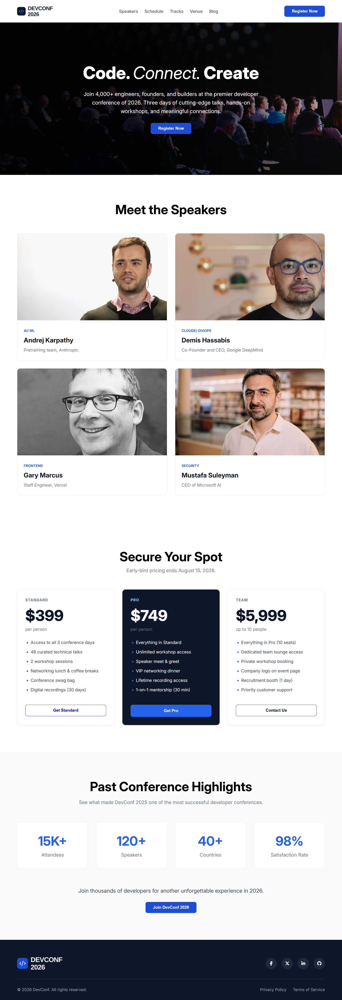

# DevConf 2026 Landing Page

A modern and professional landing page for **DevConf 2026**, a fictional developer conference website. This project was built with **HTML5 and CSS3** to practice semantic HTML, modern CSS layouts, reusable components, and frontend development fundamentals.

The landing page includes a hero section, conference highlights, speaker profiles, ticket pricing, navigation, call-to-action sections, and a footer with social links.

---

## 🌐 Live Demo

🔗 **Live Website:** https://naderarrahman.github.io/devconf-2026-landing-page/

🔗 **GitHub Repository:** https://github.com/naderarrahman/devconf-2026-landing-page

---

## 📸 Project Preview

---

## ✨ Features

- Modern developer conference landing page
- Clean and professional navigation bar
- Hero section with call-to-action
- Conference highlights section
- Speaker showcase with speaker profiles
- Multiple ticket pricing plans
- Reusable button and card components
- Modern card-based UI layout
- CSS hover effects
- Background images and overlays
- Social media links in the footer
- Semantic HTML5 structure
- Organized and maintainable CSS

---

## 🛠️ Technologies Used

- **HTML5** – Semantic page structure and content
- **CSS3** – Styling, layouts, spacing, and visual design
- **Flexbox** – One-dimensional layouts and alignment
- **CSS Grid** – Structured multi-column layouts
- **Google Fonts** – Custom typography
- **Font Awesome** – Icons used throughout the interface

---

## 📦 Dependencies

This is a static frontend project, so it does not require any package manager or JavaScript framework.

External resources used in the project:

- Google Fonts
- Font Awesome

No `npm`, Node.js, React, or other JavaScript dependencies are required to run this project.

---

## 📂 Project Structure

    devconf-2026-landing-page/
    │
    ├── assets/
    │   ├── andrej.png
    │   ├── banner.jpg
    │   ├── demis.png
    │   ├── footer-logo.png
    │   ├── gary.png
    │   ├── logo-mini.png
    │   ├── logo.png
    │   ├── mustafa.png
    │   └── naderarrahman-github-io-devconf-2026-landing-page-2026.png
    │
    ├── index.html
    ├── style.css
    └── README.md

---

## 🚀 Run the Project Locally

Since this is a static HTML and CSS project, you can run it locally without installing any dependencies.

### 1. Clone the repository

    git clone https://github.com/naderarrahman/devconf-2026-landing-page.git

### 2. Navigate to the project directory

    cd devconf-2026-landing-page

### 3. Open the project

Simply open the `index.html` file in your browser.

You can also use **VS Code with the Live Server extension** for a better development experience.

### Using Live Server

1. Open the project folder in VS Code.
2. Install the **Live Server** extension.
3. Right-click `index.html`.
4. Select **Open with Live Server**.
5. The website will open in your browser.

---

## 🎯 What I Practiced

While building this project, I practiced:

- Semantic HTML5
- CSS Flexbox
- CSS Grid
- Reusable CSS classes
- Component-style UI organization
- Responsive layout concepts
- Typography and font management
- Card-based layouts
- Background images and overlays
- Hover effects
- Spacing and alignment
- Clean project structure
- Git and GitHub workflow
- GitHub Pages deployment

---

## 📚 Learning Objectives

The main purpose of this project was to strengthen my frontend development fundamentals.

Through this project, I improved my understanding of:

- Structuring webpages with semantic HTML
- Creating layouts with Flexbox and CSS Grid
- Building reusable UI elements
- Managing typography and spacing
- Creating visually consistent card layouts
- Using external fonts and icon libraries
- Organizing frontend project files
- Deploying a static website using GitHub Pages

---

## 🔮 Future Improvements

Planned improvements for future versions include:

- Fully responsive design for mobile and tablet devices
- Hamburger navigation menu
- Smooth scrolling
- CSS animations and transitions
- Dark mode
- Registration page
- Improved accessibility
- Better keyboard navigation
- Form validation
- More interactive conference sections

---

## 📌 Project Status

**Version:** `v1.0`

✅ Initial release completed.

The current version focuses on the core landing page design and frontend development fundamentals.

Future versions will focus on responsiveness, accessibility, animations, and additional interactive features.

---

## 👨‍💻 Author

### Nader Ar Rahman

Frontend Developer & LIS Student

- 🔗 **GitHub:** https://github.com/naderarrahman
- 🔗 **LinkedIn:** https://www.linkedin.com/in/naderarrahman/

---

## 📄 License

This project is created for **learning and portfolio purposes**.
